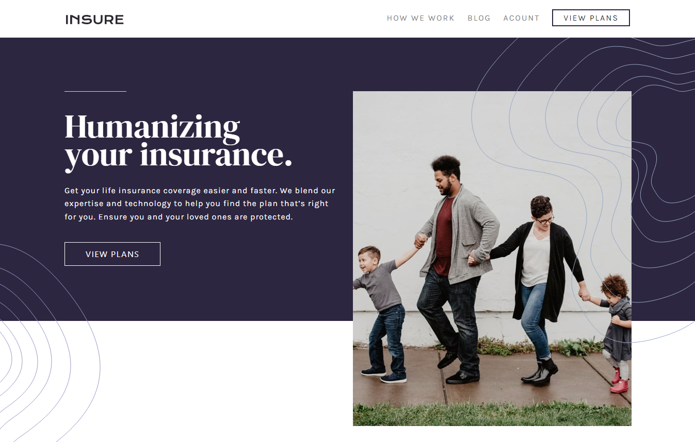

# Frontend Mentor - Insure landing page solution

This is a solution to the [Insure landing page challenge on Frontend Mentor](https://www.frontendmentor.io/challenges/insure-landing-page-uTU68JV8). Frontend Mentor challenges help you improve your coding skills by building realistic projects. 

## Table of contents

- [Overview](#overview)
  - [The challenge](#the-challenge)
  - [Screenshot](#screenshot)
  - [Links](#links)
- [My process](#my-process)
  - [Built with](#built-with)
  - [Useful resources](#useful-resources)
- [Author](#author)

## Overview

### The challenge

Users should be able to:

- View the optimal layout for the site depending on their device's screen size
- See hover states for all interactive elements on the page

### Screenshot

### Links

- Live Site URL: [Add live site URL here](https://insure-dun.vercel.app/)

## My process

### Built with

- Semantic HTML5 markup
- CSS custom properties
- Flexbox
- CSS Grid
- responsiveness with Media Queries
- A Little Bootstrap 4 Grid System
- Media Queries

### Useful resources

- [CSS grid resource 1](https://css-tricks.com/snippets/css/complete-guide-grid/) - This helped me for CSS grid understanding. I really liked this powerful layout and I will use it going forward.
- [Bootstrap 4 Grid System Documentation](https://getbootstrap.com/docs/4.6/layout/grid/)

## Author

Mahmoud Hanouneh, I am a telecommunication engineer and have a passion about learning web technologies.

- LinkedIn - [Mahmoud Hanouneh](https://www.linkedin.com/in/mahmoud-hanouneh/)
- Frontend Mentor - [@mahmoud-hanouneh](https://www.frontendmentor.io/profile/mahmoud-hanouneh)

